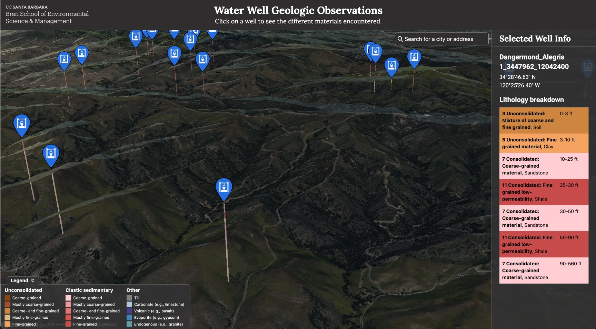
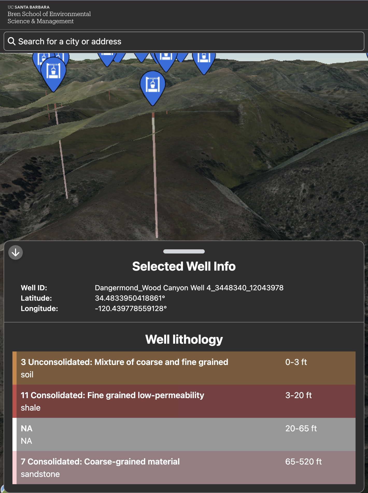

# 3D Water Well Map Visualization

This project is a 3D map visualization built using Cesium to dynamically display all of the water wells in the United States. It provides an interactive experience where users can explore and analyze water well data across the country in real-time.



## Project Description

-   **Technology Stack:** The project is built with React, TypeScript, and Vite, utilizing CesiumJS for 3D geospatial visualization.
-   **Functionality:** The application dynamically loads and visualizes data for millions of water wells across the U.S. as the user interacts with the map.
-   **Performance:** Data is loaded and rendered efficiently to minimize latency, ensuring smooth performance even with large datasets.



## Getting Started

### Prerequisites

Ensure you have the following installed:

-   **Node.js** (version 14 or later)
-   **pnpm** (or npm/yarn if you prefer)

### Setup Instructions

After cloning the repo:

1. **Install the dependencies:**

    ```bash
    pnpm install
    ```

2. **Start the Development Server:**

    ```bash
    pnpm run dev
    ```

3. **Build for Production**

    ```bash
    pnpm run build
    ```
